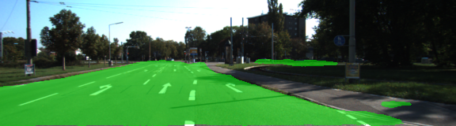

# Semantic Segmentation

Mario Lüder

### Introduction

This project, uses a Fully Convolutional Network (FCN) for semantic segmentation of roads. As input serve images from [Kitti Road dataset](http://www.cvlibs.net/datasets/kitti/eval_road.php) from [here](http://www.cvlibs.net/download.php?file=data_road.zip)

### Architecture

The architecture of the network is implemented like shown in the picture below:

### Why Layer 3, 4 and 7?
In `main.py`, you'll notice that layers 3, 4 and 7 of VGG16 are utilized in creating skip layers for a fully convolutional network. The reasons for this are contained in the paper [Fully Convolutional Networks for Semantic Segmentation](https://arxiv.org/pdf/1605.06211.pdf).

In section 4.3, and further under header "Skip Architectures for Segmentation" and Figure 3, they note these provided for 8x, 16x and 32x upsampling, respectively. Using each of these in their FCN-8s was the most effective architecture they found. 

### Results

## Setup
### GPU
`main.py` will check to make sure you are using GPU - if you don't have a GPU on your system, you can use AWS or another cloud computing platform.
### Frameworks and Packages
Make sure you have the following is installed:
 - [Python 3](https://www.python.org/)
 - [TensorFlow](https://www.tensorflow.org/)
 - [NumPy](http://www.numpy.org/)
 - [SciPy](https://www.scipy.org/)

You may also need [Python Image Library (PIL)](https://pillow.readthedocs.io/) for SciPy's `imresize` function.

### Dataset
Download the [Kitti Road dataset](http://www.cvlibs.net/datasets/kitti/eval_road.php) from [here](http://www.cvlibs.net/download.php?file=data_road.zip).  Extract the dataset in the `data` folder.  This will create the folder `data_road` with all the training a test images.
